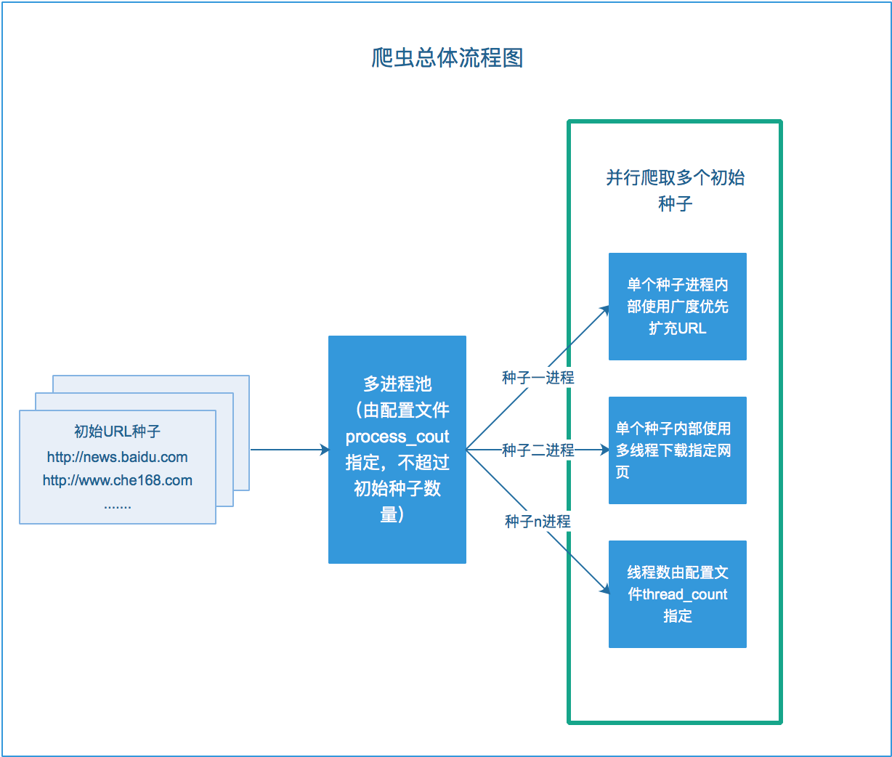
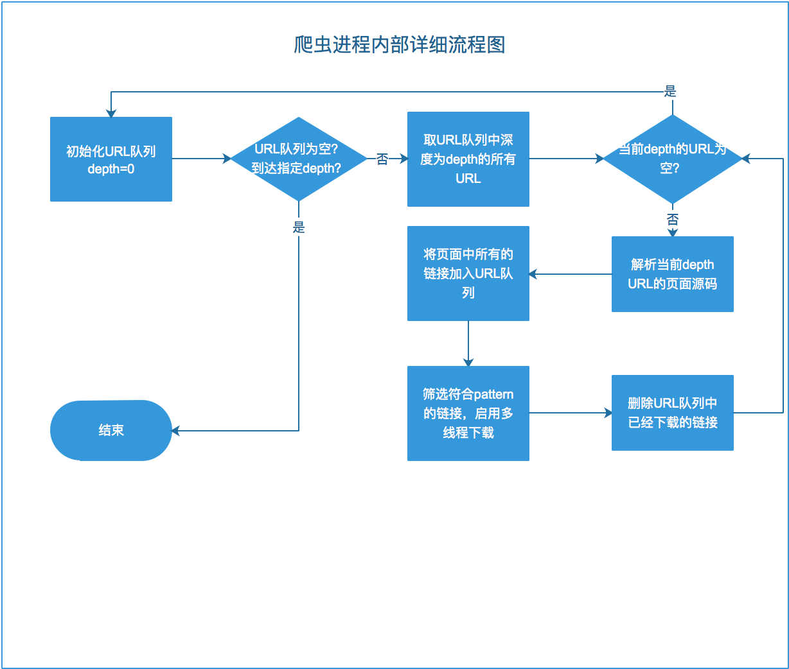

#一、目录结构

```
--root
    |--config 爬虫配置文件目录
    |--output 爬虫下载文件的存储目录
    |--urls   爬虫种子URL文件目录
    |--doc    说明文档的图片等素材目录
    |--test   单元测试目录
```

#二、架构与流程设计

> 爬虫在满足题目要求的基础上，加入了多进程的支持，每个原始种子（顶级域名）可进行并行爬取（不超过配置文件设置的
    进程数量限制的情况下），同时每个原始种子内部的爬取使用多线程处理IO密集的下载任务，整体架构如下图所示

</img>

> 为了对Python的多线程更为熟练，本次未使用futures.concurrent包中的ThreadExecutorPool线程池，而是自己通过
    继承Thread类，实现了简单的线程上限管理调配。


> 其中每个进程内部爬取，解析，扩展，下载的流程如下图所示


</img>
